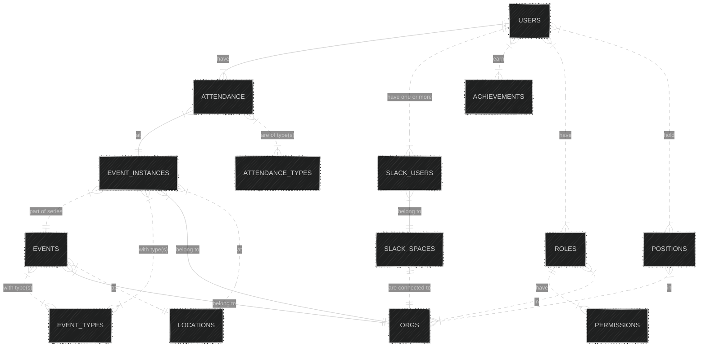

# Overview

This package includes `sqlalchemy` ORM models that mirror those used by `drizzle` in `packages/db/drizzle`. These are utilized by `apps/slackbot` for db access management. However, we are in a slow transition to utilizing the F3 API for all db interactions in the app, and may eventually be able to deprecate this package.

> [!NOTE]
> This package used to be used to migrate the database; going forward, all migrations should be done via drizzle (with corresponding model changes here)

# Optional BigQuery Sessions

The default database session path is PostgreSQL. To explicitly request a BigQuery session, pass the optional `backend` argument:

```python
from f3_data_models.utils import get_session

postgres_session = get_session()
bigquery_session = get_session(backend="bigquery")
```

`session_scope(...)` and `DbManager` methods also accept the same optional `backend` argument.

BigQuery mode requires these environment variables:

- `BIGQUERY_PROJECT`
- `BIGQUERY_DATASET`

Authentication should be provided through Google Application Default Credentials in the runtime environment.

# Entity Overview


